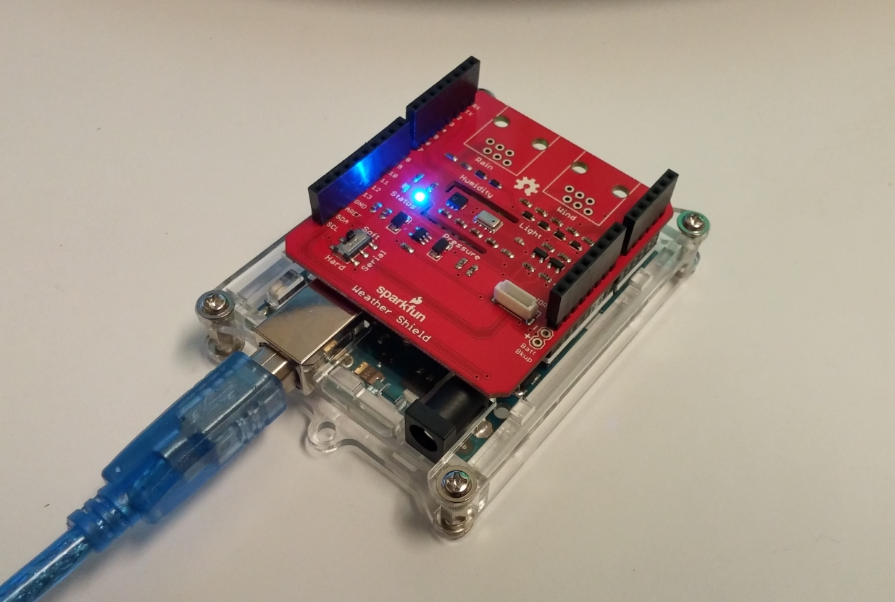
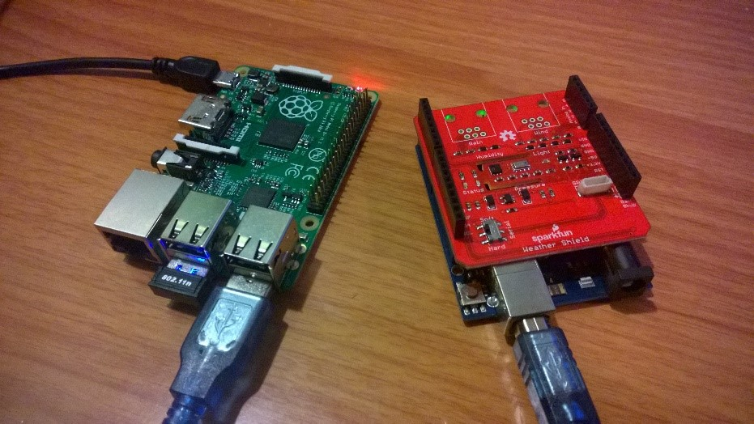

# Setup Arduino and Weather Shield #
This document explains how to setup an Arduino Uno R3 with a Sparkfun weather shield for monitoring temperature and humidity in the Connect The Dots getting started project. It assumes that you have the right tools installed and that you have cloned or downloaded the ConnectTheDots.io project on your machine.

##Hardware requirements ##
See [Hardware](Hardware.md) file in this folder for the required hardware.

##Prepare the Arduino Uno R3 ##

* Connect the Arduino Uno R3 directly to your computer with the USB cable
* Install and run the Arduino IDE (we recommend the current official release, with the Windows Installer) which you can find on the [Arduino.cc](http://arduino.cc/en/Main/Software) website.
* If necessary, install the Windows device drivers for the Arduino on your computer, following the instructions [here](http://arduino.cc/en/Guide/Windows#toc4).
* Download the Weather Shield libraries from [here](https://dlnmh9ip6v2uc.cloudfront.net/assets/b/5/9/7/f/52cd8187ce395fa7158b456c.zip) (as per the instruction in the [Weather Shield Hookup guide](https://learn.sparkfun.com/tutorials/weather-shield-hookup-guide)).
    * Extract all files from the ZIP file to a temporary location, then import the two folders (HTU21D_Humidity and MPL3115A2_Pressure) in the Arduino IDE by clicking *Sketch > Include Library > Manage Libraries...* and selecting the folder (once for each folder).
* In the Arduino IDE open `Devices/GatewayConnectedDevices/Arduino UNO/Weather/WeatherShieldJson/WeathershieldJson.ino`. (It is modified from the original Sparkfun sample to send data in JSON format as well as additional self-describing fields.) Edit the code to set your own values for the first four constants (GUID - Location) - for example, DisplayName will contain the label for the sensor on the website. (If you send multiple variables (e.g. temp and humidity), you need to reproduce the UnitOfMeasure and the MeasureName fields. See the  Serial print statements in WeatherShield INO file for a more detailed implementation example).
   
		char GUID[] = "81E79059-A393-4797-8A7E-526C3EF9D64B";
		char Organization[] = "Me";
		char DisplayName[] = "Weather Shield 01";
		char Location[] = "My office";
		char MeasureName[] = "temperature";
		char UnitOfMeasure[] = "F";
		char MeasureName2[] = "humidity";
		char UnitOfMeasure2[] = "%";
		char MeasureName3[] = "light";
		char UnitOfMeasure3[] = "lumen";

* Compile and upload the Weather Shield sketch to the Arduino: *Sketch > Upload* or Ctrl-U. 
	* If the upload fails, make sure you have the correct board selected on the correct COM port through `Tools > Port` menu.
* Open the serial monitor (Shift-Ctrl-M). You should now see temperature and other data on the serial monitor. Note the format of the data being sent out the serial port of the Arduino – in the next section you’ll see the same data being read from the serial port of the Raspberry Pi:

* Disconnect the Arduino from your computer

##Connect the Arduino board to the gateway ##

* Plug Arduino’s USB cable into one of the Raspberry Pi USB ports:

Now you're ready to get your [Raspberry Pi setup](../../../../Gateways/GatewayService/RaspberryPi-Gateway-setup.md).